# ERP Team Project
---

## 1. 프로젝트 소개

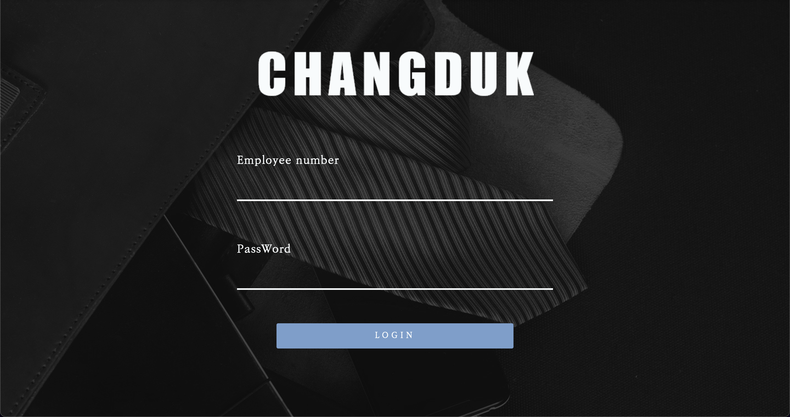

- 가상의 회사 Chang Duk 이라는 넥타이 판매를 하는 회사를 만들어서 그 회사의 구성원들이 회사 데이터 관리를 편하게 하기 위해서 전사적 자원 관리(ERP) 시스템 Project를 기획 했습니다.

- 현재 관리자 페이지의 기능과 유저 - 마이 페이지, 공급처, 회계 부분만 기능을 만들어 두었습니다.
   

## 2. 기능 소개

### 메인 페이지

- 메인 페이지는 ERP 특성상 로그인을 하기전에 어떠한 기능도 사용할 수 없으므로 로그인 페이지를 메인 페이지로 지정했습니다.
- 로그인 완료 후 아이디에 User 객체를 세션에 저장하고 그 객체에서 입력한 아이디를 검증을 해서 admin 일 경우 관리자 페이지로 이동, user 일 경우 유저 페이지로 이동하게 했습니다.

   

### 관리자 페이지
- **관리자 메인**
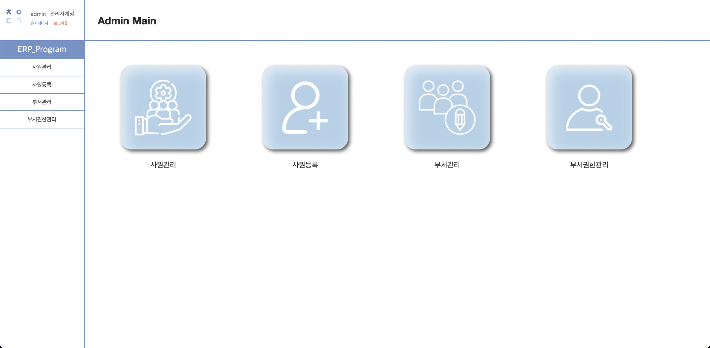

  

- **사원 등록**
    - 먼저 유저 페이지의 기능을 이용을 하려면 만들어둔 관리자 계정으로 접근 후 사원 등록을 통해 아이디를 등록해야 합니다.
    - 사원 등록 시 이미 등록되어 있는 부서가 있으면 리스트로 모두 불러오게 만들어서 사용자가 선택시 해당 부서에 맞는 사원 번호를 자동으로 배정해줍니다. (부서번호 + 순번)
    - 비밀번호는 기본 비밀번호를 배정하여 사원 등록 후 사용자가 직접 변경 할 수 있도록 했습니다.
    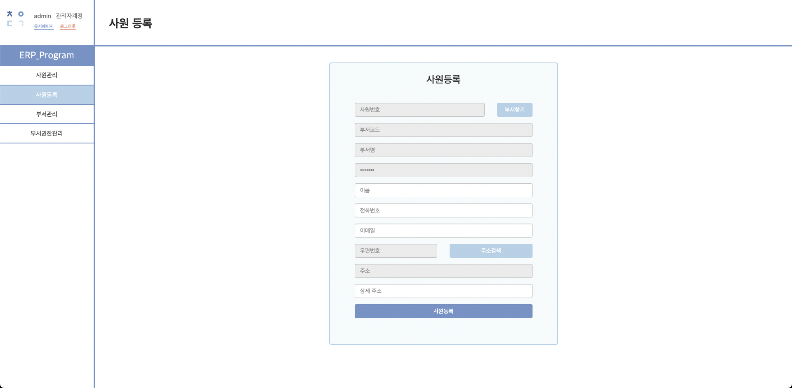
      
    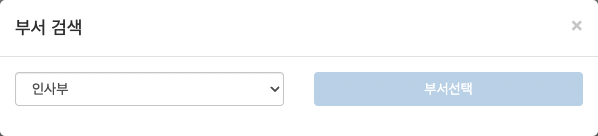
      
    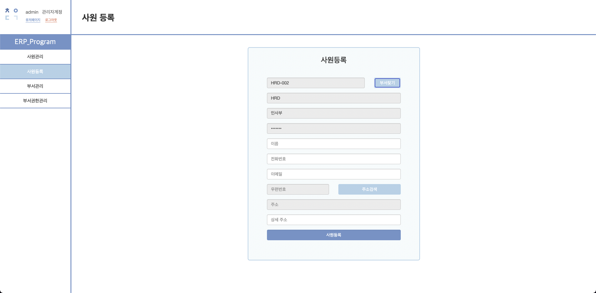
    

   

- **사원 조회**
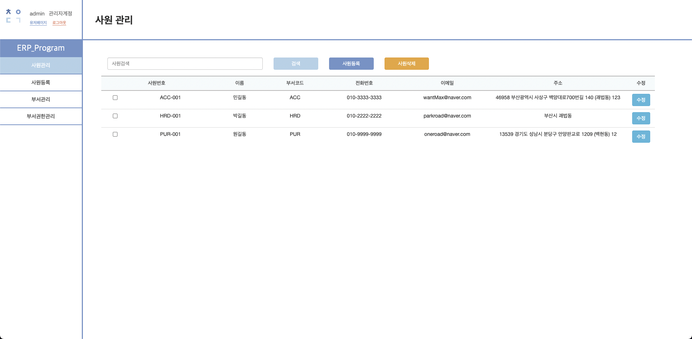
    - 등록되어 있는 모든 사원을 조회 할 수 있으며 삭제, 수정(사원 번호는 수정 불가)을 할 수 있습니다.
    

    
   

- **부서 관리**
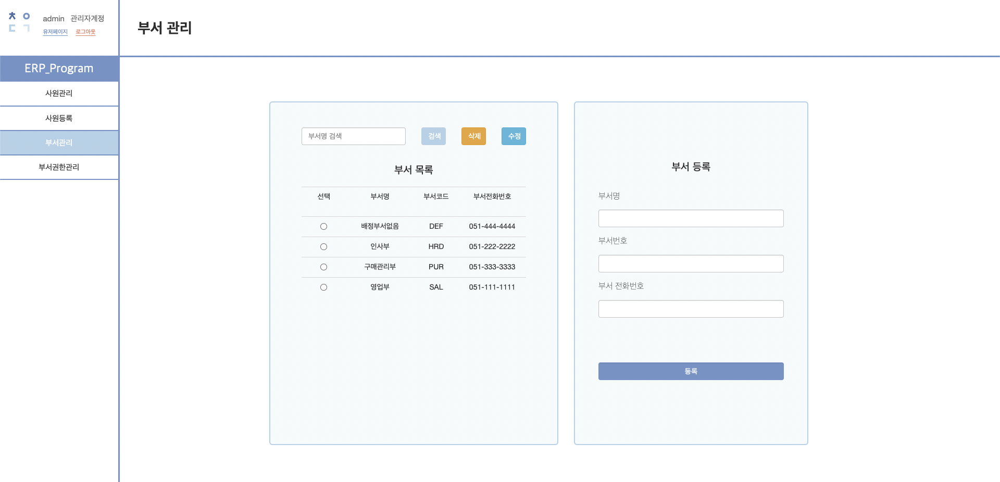
    - 모든 부서를 조회할 수 있으며 등록, 삭제, 수정을 할 수 있습니다.

   
   

- **부서 권한 관리**
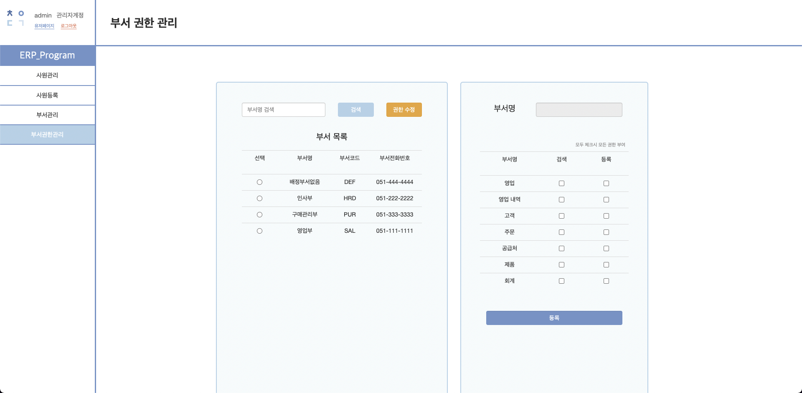
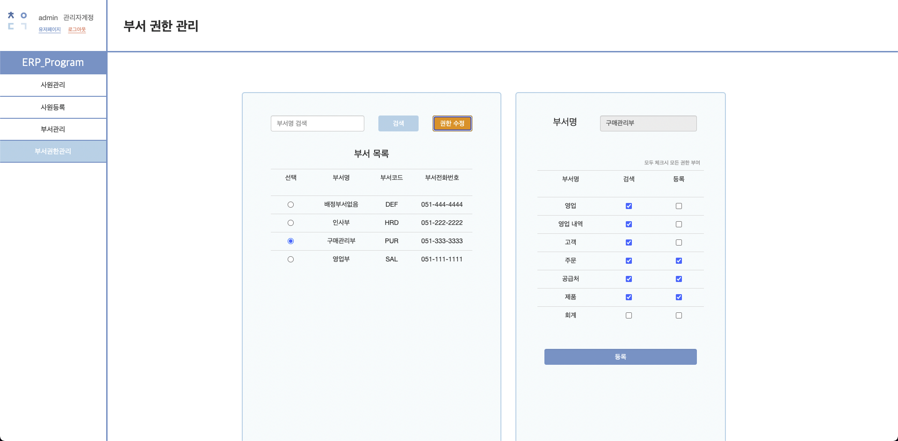
    - 등록 되어 있는 각 부서의 권한을 수정할 수 있습니다.
        - **기본값** : 모두 체크 해제 (생성시 자동적용)
        - **모두 체크 해제시** : 페이지 접근 불가
        - **조회만 체크시** : 조회만 가능
        - **수정만 체크시** : 등록만 가능
        - **모두 체크시** : 모든 기능 사용 가능

      
   

### 유저 페이지
- **유저 메인**
- 
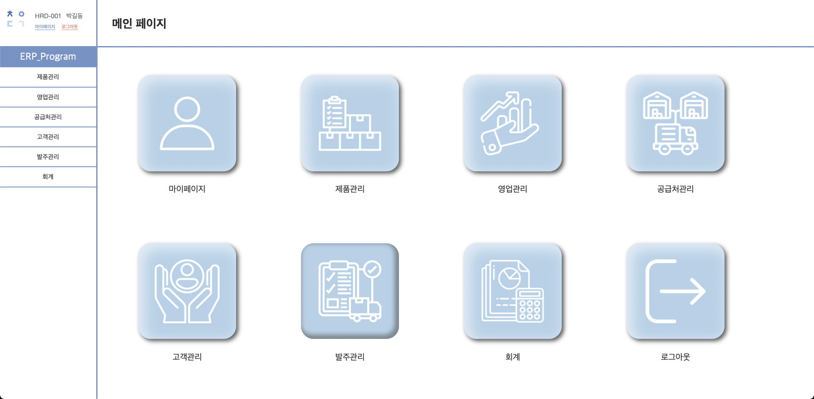

   

- **마이 페이지**
    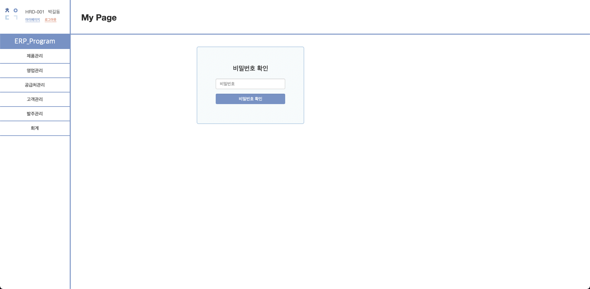
    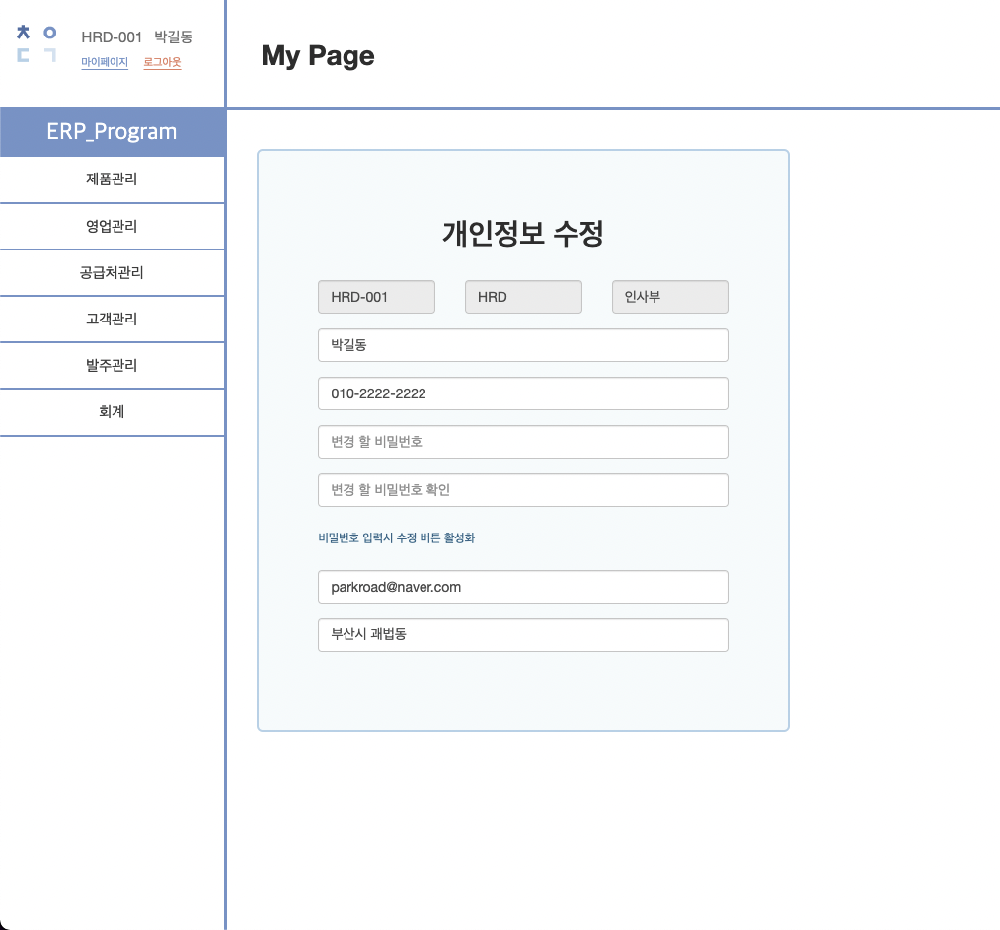
    - 마이 페이지 접근시 로그인한 사용자의 비밀번호 체크를 해서 세션의 계정의 비밀번호와 맞으면 마이 페이지로 접근하게 했습니다.
    - 비밀번호 체크 없이 마이페이지로 바로 접근을 하려고 할 시 접근 불가
        - 비밀번호 체크시 세션에 비밀번호 체크 완료 세션을 넣어두고 마이 페이지로 이동하게끔 만들었습니다.
        - 마이페이지에서 수정완료 후 로그인 페이지로 이동(로그아웃)

   

- **공급처 관리**
    - **권한이 있을때** 
    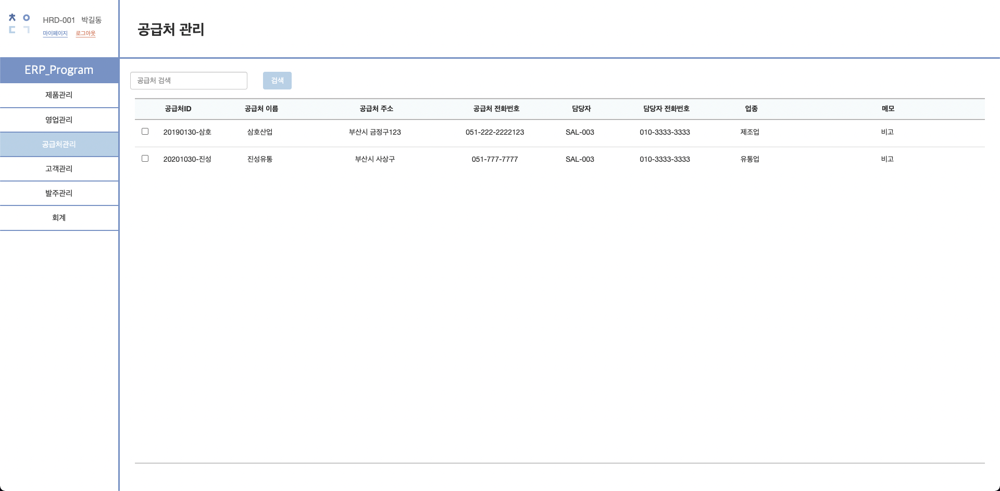
       
    - **권한이 없을때** 
    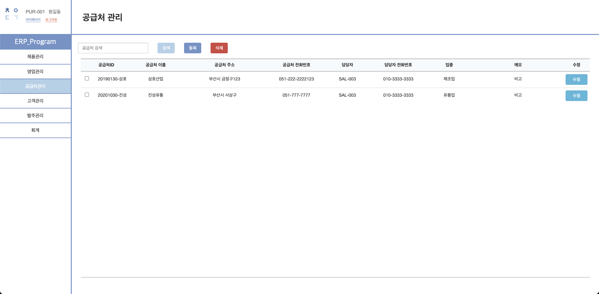
       
    
    - **CRUD**
    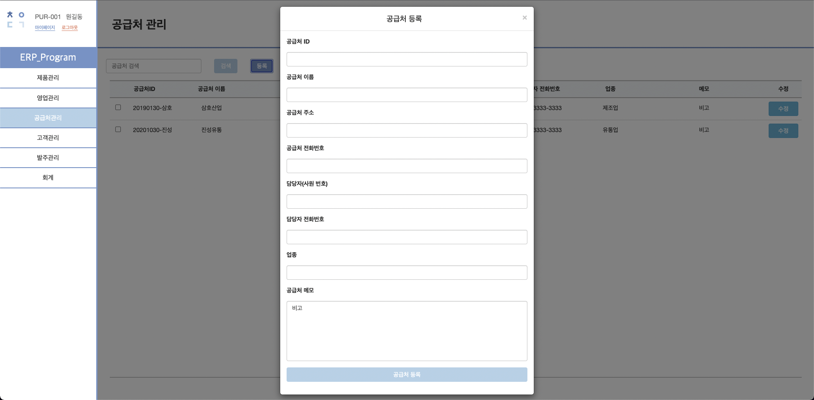
    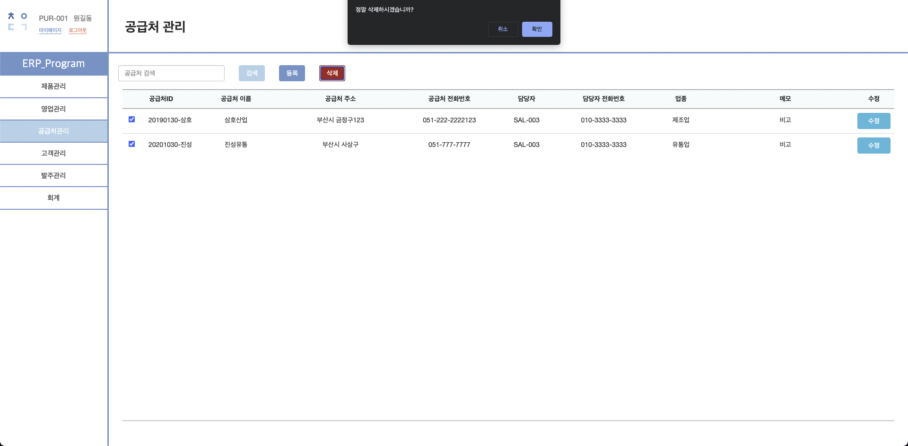
    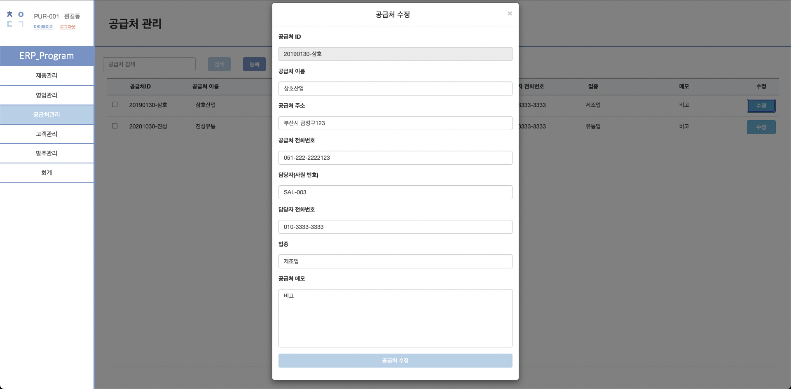
    - 등록되어 있는 모든 공급처에 대한 조회, 등록, 수정, 삭제를 할 수 있습니다.
    - 페이지 접근시 로그인할때 세션에 넣어둔 User 객체에서 부서 번호를 검증 후 페이지의 권한을 조회해서  권한마다 기능들을 제한 시켰습니다.

   
    
- **회계 관리**
    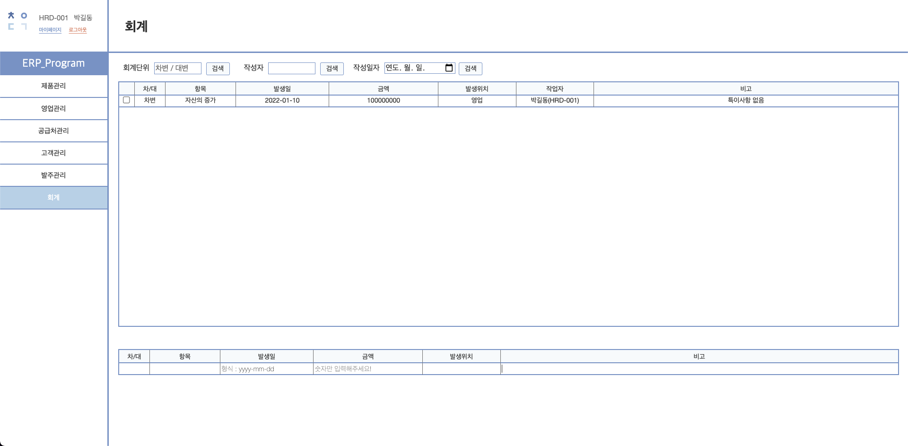

    - 처음 프로젝트 설계시 회계는 간단한 회계단위로만 나누어 놓고 등록만 가능하게 설계를 했습니다.
    - 회계 데이터 등록시 작성자는 세션에 등록된 User의 “이름(사원번호)” 로 등록되게 했습니다.
    - 검색 창은 자주 검색할  것 같은 회계단위, 작성자, 작성일 기준으로 3칸으로 나누어 놨습니다.

   

## 3. 사용 기술
    
   

## 4. 협업시 맡은 부분

- Back-end :
    - [ByeonSeongWook](https://github.com/ByeonSeongWook) : 관리자 기능과 페이지, 유저 공급처 기능과 페이지, 유저 회계 기능, 마이 페이지
    - [ssb4887](https://github.com/ssb4887) : 유저 제품 기능과 페이지
- Front-end :
    - [eing98](https://github.com/eing98) : 디자인, 회계 페이지
   
    
    

## 5. 소요기간

- 22.12.15 ~ 22.01.14 (약 1달)
